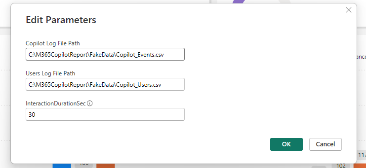

# M365 Copilot And Copilot Chat Audit Power BI Report
> [!NOTE]
> Report supports non-licenced users that use Copilot Chat.
> 
> Added support for manager structure. Please make sure you have Managers populated in Entra AD.
>
> Please archive previous csv files, before running new scripts as csv files structure has changed.

This report is using data from Purview Audit log and Entra ID exports that get saved into two CSV files. The first csv file is storing Copilot Interaction events and other csv is exporting user details (Display Name, UPN, Position, City, Country) for users that have M365 copilot license assigned. Power BI report is reading data from those these two files and can display users **Display names** or **anonymize** them. Report contains Overall and Adoption pages that allow M365 Champs to monitor behavior of M365 Copilot licensed users.
### Overall report

### Agents usage

### Org Comparison

### Org Decomposition

### Impact report

### Decomposition report

### Adoption report

### Trend

## Features
1. Time of the day interaction
2. Copilot Studio Agents Usage
3. Application ratio
4. Monthly interactions
5. Weekly Interactions
6. Top active users
7. Top sources
8. Time spent in minutes
9. Time spent in hours and minutes
10. Time decomposition by departments and positions
11. Employee names anonymizer
12. Active vs total licenses assigned
13. Trend comparison between two departments
14. Slicers
    - Time range
    - Application
    - Employee
    - Position
    - Departments

## Prerequisites
> [!NOTE]
> Based on Search-Unified audit log permissions, insure these roles are assigned to user:
> 
> Audit Logs
> Information Protection Analyst, Information Protection Investigator, View-Only Audit Logs

Download the latest version of all files from scripts folder. 
1.	M365 Copilot Licenses assigned to users and some history with it :)
2.	Make sure your users have managers populated for Org related reports
3.  Security Reader role (minimum)

4.  Member of Purview Role Groups (Audit Reader)

5.	Power BI Desktop (most recent version) [Download link](https://aka.ms/pbidesktopstore)
6.	Windows PowerShell 7 [Download link](https://learn.microsoft.com/en-us/powershell/scripting/install/installing-powershell-on-windows?view=powershell-7.4)
7.	User Departments populated in Entra (Azure AD)
## Scripts and supporting files
> [!NOTE]
> Download all files from [Scripts](https://github.com/BojanBuhac/M365-Copilot-Audit-Report/tree/main/scripts)
## Initial configuration
1.	Open **Audit-Get-Events.ps1** and edit the $logFile (line 29) and $outputFile (line 30) so it matches your desired path.
2.	Open **Audit-Get-Users.ps1** and edit the $csvUserspath (line 23) so it matches your desired path.

> [!NOTE]
> GCC tenants Copilot SKU GUID
> The SkuID for Copilot in GCC environments is different than the one for commercial environments, resulting in an empty Copilot_Users.csv when Audit-Get-Users.ps1 is run. Line 24 can be replaced with the following to fix this:
> Get-MgUser -Filter "assignedLicenses/any(x:x/skuId eq $('a920a45e-67da-4a1a-b408-460d7a2453ce'))" -ConsistencyLevel eventual -CountVariable CopilotLicensedUserCount -All -Property DisplayName, UserPrincipalName, jobTitle, Department, City, Country, UsageLocation | Select-Object DisplayName, UserPrincipalName, jobTitle, Department, City, Country, UsageLocation | Export-csv $csvUserspath -NoTypeInformation

## Extracting AD users
1.	Run PowerShell 7 as Administrator
2.	Run **Audit-Get-Users.ps1** from Windows PowerShell
3.	Once you get prompted to authenticate, authenticate with an account that has at least Security Reader Permissions (Global Admin will work of course).
4.	Once the script is complete, the folder will include **Copilot_Users.csv** that will contain list of users from your tenant that have M365 Copilot License assigned.
## Extracting Copilot Interactions
1.	Run PowerShell 7 as Administrator
2.	Run **Audit-Get-Events.ps1** from Windows PowerShell
3.	Once you get prompted to authenticate, authenticate with an account that has at least Security Reader Permissions (Global Admin will work of course).
4.	Once the script is complete, the folder will include **Copilot_Events.csv** that will contain list of all copilot events that exist in your Audit log.
> [!NOTE]
> First time you run the **Audit-Get-Events.ps1** script may run for long time depending on the number of user interactions in Purview Audit Log. Once it completes, next time you run the same script it will read last event from csv file and use it as start date/time.
> Default script retrieval setting are 5000 records/24 hours. 5000 records is max batch value. **If you expect to have more than 5000/24h records, reduce the number of minutes in script line 43 {$intervalMinutes = 1440} from 1440**:
> - 1440 - 5000/24 hours
> - 720 - 5000/12 hours
> - 360 - 5000/4 hours
## Power BI Template configuration
1. Open M365 Copilot Audit Report.pbit with Power BI Desktop
2. You will get prompted with M365 Copilot Audit Report configuration screen (for Approximate interaction time in seconds type 30)

3. Populate it with parameters captured in Initial configuration section.
4. Press Load button and click Connect
5. Report will start to pull data from two files
6. Save the Report as **M365 Copilot Audit Report.pbix** to your PC
## Anonymizing users
In case you want to anonymize user Display names in Power BI report:
1. Click on the Employee visual
2. Click x next to Employee in Visualizations pane to remove employees.
3. Tick the box on Anonymous in Data Pane

4. Repeat the same steps for Top Active users visual and Top users on Trends page
